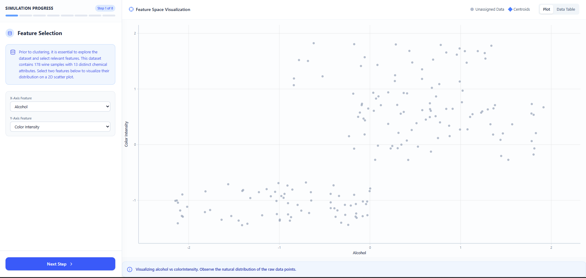
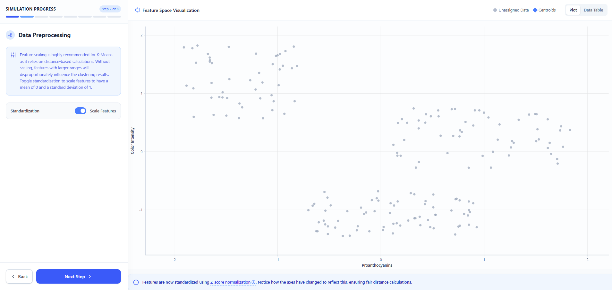
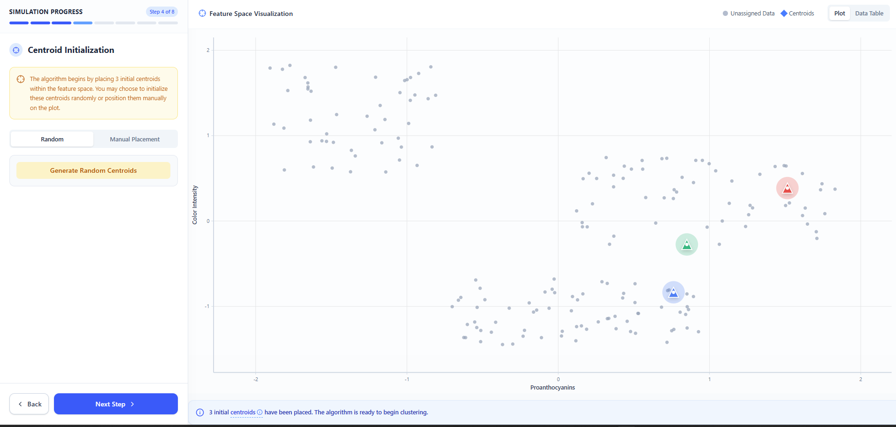
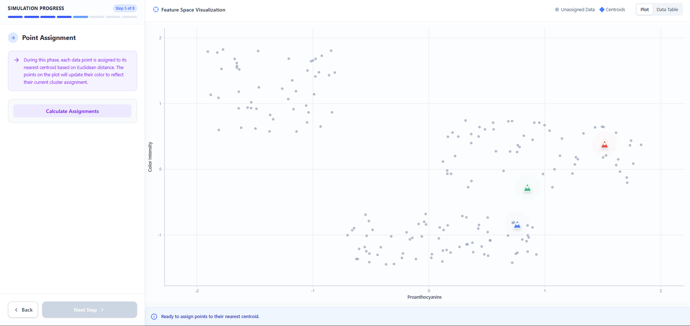
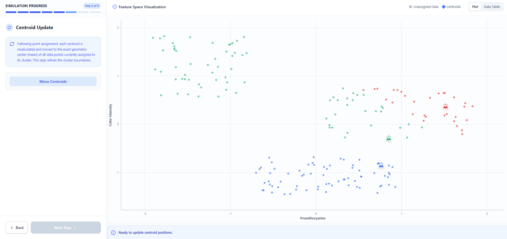
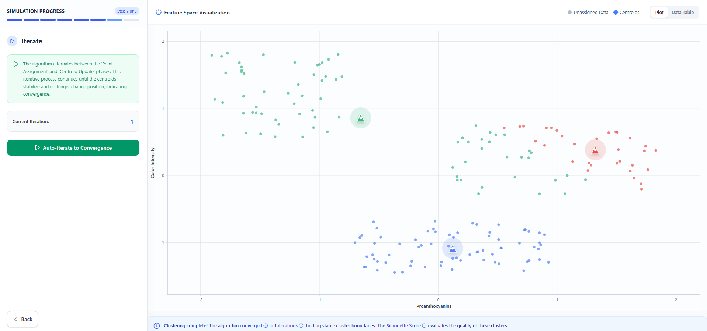
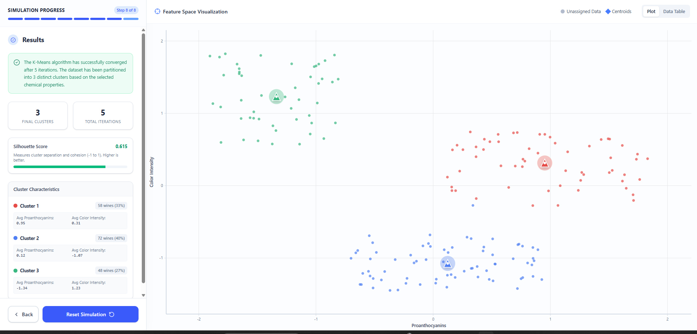

 click the  **"Start Simulation"** button to begin.

#### Step 1: Data Preprocessing

Toggle the **"Standardize Features (Z-Score)"** switch on or off.

Turning it on ensures that features with larger numbers don't unfairly dominate the clustering process.

Click **"Next Step"**.

#### Step 2: Determine K (Number of Clusters)

Look at the **"Elbow Method"** plot on the right.

Try to find the **"elbow" point** where the line starts to flatten out.

Use the **"Number of Clusters (K)"** slider on the left to set your desired number of clusters.

Click **"Next Step"**.

#### Step 3: Centroid Initialization

Choose your initialization method: **Random** or **Manual**.

If you chose **Random**:  
Click the **"Initialize Randomly"** button to let the app place the starting points.

If you chose **Manual**:  
Click directly on the **scatter plot** on the right to place your starting centroids yourself (**you must click exactly K times**).

Once the centroids are placed, click **"Next Step"**.

#### Step 4: Point Assignment

Click the  **"Calculate Assignments"** button.

You will see the data points change color to match their **closest centroid**.

Click **"Next Step"**.

#### Step 5: Centroid Update

Click the **"Move Centroids"** button.

Watch the larger centroid markers move to the **exact center of their newly assigned colored points**.

Click **"Next Step"**.

#### Step 6: Iterate

Click the  **"Auto-Iterate to Convergence"** button.

The app will automatically repeat the **assignment and update steps** until the centroids stop moving.

Wait a few seconds for it to finish.

#### Step 7: Results

Review your **final clusters**, the **total number of iterations**, and the **Silhouette Score** (which grades how well-separated your clusters are).

To try again with different features or a different **K**, click **"Reset Simulation"** at the bottom to start over.